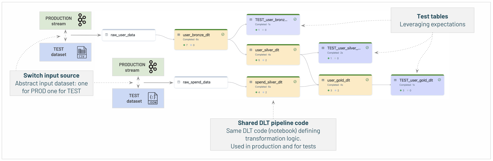

# :cyclone: turbines

This project deploys a Databricks Asset Bundle containing a Delta Live Table pipeline to a databricks environment for ingesting, cleaning and summarising turbine telemetry file data.

## :runner: Getting Started

This guide assumes you have _python_, _poetry_ and _databricks-cli_ installed, and you have access to a databricks workspace with a catalog, a schema and a volume in which to land the files.

1. Update the bundle variables `catalog`, `schema`, `rule_table` and `landing_location` as required
2. Set your workspace id in the bundle target
3. Login to your databricks instance by running\
    ```databricks auth login --host <your workspace host>```
4. Validate the bundle by running\
    ```databricks bundle validate```
5. Deploy the bundle to the databricks workspace by running\
    ```databricks bundle deploy```
6. Drop telemetry files into the landing location to trigger a pipeline update

## :mag: Assumptions

* The problem appeared to suggest data will be appended as additional rows within a single set of CSV files. Given this is not a typical pattern and seems unscalable, the assumption has been made that (daily) new data will arrive in new files.

## :factory: Pipeline

The pipeline is implemented using Delta Live Tables to ingest and transform the turbine data.

* DLT provides a simple declarative definition of a pipeline
* Orchestratates the defined streaming "flow"
* Checkpointing is managed
* Data quality and pipeline flow are visualised 

In this scenario, because files arrive daily, the pipeline runs in _"triggered"_ mode, as opposed to continuous. A job with a file trigger invokes the pipeline, which picks up new files arrived at the landing location. This non-continuous mode is more cost-effective for infrequent batch ingestion. 

### Medallion architecture

| **Layer** | **Description** |
|-----------|-----------------|
| :3rd_place_medal:<br>**Bronze** | The raw data ingested via autoloader and stored without any transformation. The exceptions to this are _(a)_ column types are inferred to allow more meaningful data quality queries/dashboards (autoloader keeps bad data in the "rescued data" column), and _(b)_ additional audit information on the file name and timing |
| :2nd_place_medal:<br>**Silver** | The data is cleaned, and bad data is quarantined. In general, the silver layer equates to where data can start to be integrated and curated, depending on the data modelling reference architecture being used. |
| :1st_place_medal:<br>**Gold** | The telemtry data is summarised per turbine, per day. Typically in a gold layer data is presented for business use cases. |

### Expectations

DLT expectations have been used to clean the data, so they can be visualised alongside the pipeline operational UI.

A set of rules is defined in a table (created in the [refresh_dq_rules](src/turbines/tasks/refresh_dq_rules.ipynb) notebook). These rules are "refreshed" on each job invocation prior to the pipeline, rather than hard-coded to demonstrate that they could be managed via a separate operational process/framework for data validation, and dynamically updated.

## :package: Bundle structure

Databricks asset bundles make workflows and pipelines (and their source) consistently deployable to multiple target workspaces. This bundle was generated using the default python template and uses poetry for package management.

* **`resources/`** - contains the YAML definition of our job and pipeline
* **`src/`** - contains the source code and notebooks underpinning the pipeline
* **`tests/`** - unit test definitions
* **`databricks.yml`** - the top-level definition of the bundle
* **`poetry.lock`** - package dependency information
* **`pyproject.toml`** - poetry configuration file
* **`pytest.ini`** - pytest settings

## :test_tube: Testability

### Local unit tests

Transformation and other logic been kept separate from the DLT streaming table definitions, allowing some simple unit tests to be added to a selection of these functions. To run the tests, start a virtual environment, run `poetry install` and run `pytest`. This will run Spark on the local machine (requiring some additional dev dependency packages).

### Pipeline tests

Full or part testing of the actual pipeline are perhaps the most important tests for production pipelines. While not implemented here, the following is a pattern recommended by databricks for deploying test pipelines and switching between production and test inputs/outputs.




